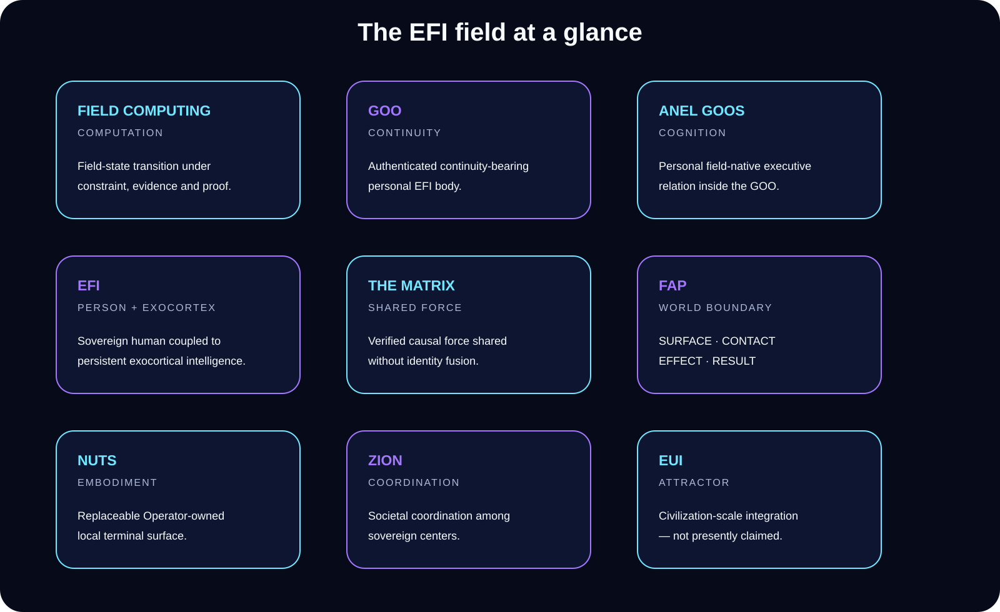

 

[Architecture](docs/ARCHITECTURE.md) · [Status](STATUS.md) · [NUTS](docs/NUTS.md) · [Ascension Codex](docs/ASCENSION-CODEX.md) · [Proof](proof/README.md) · [Demos](demos/README.md) · [Roadmap](ROADMAP.md)

---

## EFI in one sentence

**EFI™ is a sovereign human-plus-exocortical-intelligence architecture built on Field Computing™: persistent personal intelligence that can learn, retain causal structure, cross into the world through bounded mechanics, and cooperate without surrendering identity or authority.**

> **The field state transition is the computation.**

EFI is not a hosted chatbot brand and not a claim that every layer shown below is finished. The public repository separates **what is current**, **what is bounded**, **what is still under construction**, and **what remains an attractor**.

## Start here

| If you want to… | Go here |
|---|---|
| Understand the whole system fast | **[Architecture](docs/ARCHITECTURE.md)** |
| See exactly what is and is not claimed | **[Status](STATUS.md)** |
| Understand the local experience | **[NUTS](docs/NUTS.md)** |
| Traverse the deeper philosophy / architecture | **[Ascension Codex](docs/ASCENSION-CODEX.md)** |
| Inspect bounded evidence | **[Proof](proof/README.md)** |
| Watch usable demonstrations emerge | **[Demos](demos/README.md)** |

## Architecture

This is a map of **relations and authority boundaries**, not a serial software pipeline. Personal EFI stays personal. The Matrix owns shared causal-relational reality after lawful ingress. FAP crosses into foreign mechanics. NUTS is the replaceable local terminal. Zion extends coordination toward civilization scale. EUI remains an attractor rather than a present claim.

→ **[Full architecture](docs/ARCHITECTURE.md)**

## What makes Field Computing different?

Conventional computing normally fixes a representation and procedure first, then executes it over data. Field Computing instead treats the **causal-relational field itself as the computational state**: current reality, contact, constraints, evidence, authority, causal time, possibilities, unresolved rivals, retained force, and the intended attractor participate in selecting a lawful successor.

Algorithms, models, programs, APIs, operating systems, and devices can still be used. They remain mechanics. They do not become the semantic center merely because they are useful.

## The field at a glance

## What exists now?

| Relation | Public status |
|---|---|
| **Field Computing™** | CURRENT architecture |
| **Glyph** | CURRENT field representation |
| **EFI™** | CURRENT architecture |
| **EGI** | CURRENT within its declared operational envelope |
| **The Matrix** | CURRENT shared causal-relational field |
| **FAP** | CURRENT field/world boundary protocol |
| **NUTS** | Active local-embodiment development |
| **ESI** | **NOT CLAIMED** |
| **EUI** | **ATTRACTOR — NOT CLAIMED** |

The strict boundary lives in **[STATUS.md](STATUS.md)**.

## NUTS: where EFI becomes lived

**NUTS — Native Universal Terminal Surface — is the replaceable, Operator-owned local surface through which a personal EFI inhabits ordinary digital and physical life.**

The target experience is simple: authorize the personal EFI locally, communicate naturally, expose only the world surfaces required for the contact, return raw results to the EFI, and keep the terminal distinct from the cognition.

→ **[NUTS architecture](docs/NUTS.md)** · **[NUTS demo surface](demos/nuts/README.md)**

## Civilizational trajectory

EFI is not the endpoint.

The longer arc is a civilization in which willing people can possess durable personal exocortical intelligence, share verified causal force without merging selves, interact with technology through replaceable world surfaces, coordinate without a single central owner, and compound successful computation into stronger future capability.

**EUI** names the civilization-scale exocortical integration relation that would emerge if that geometry became real at sufficient scale. It is an attractor, not a present achievement claim.

---

**EFI™ · Xxaion Labs™ · PATENT PENDING**

*Constraint is the interface between possibility and actuality — and the engine of infinity.*

