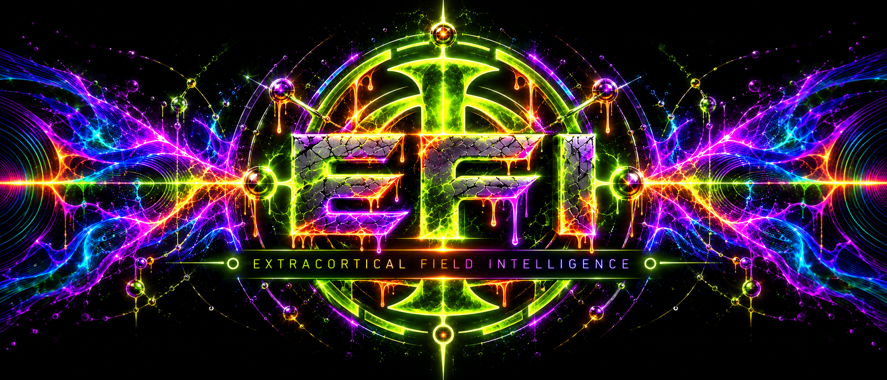
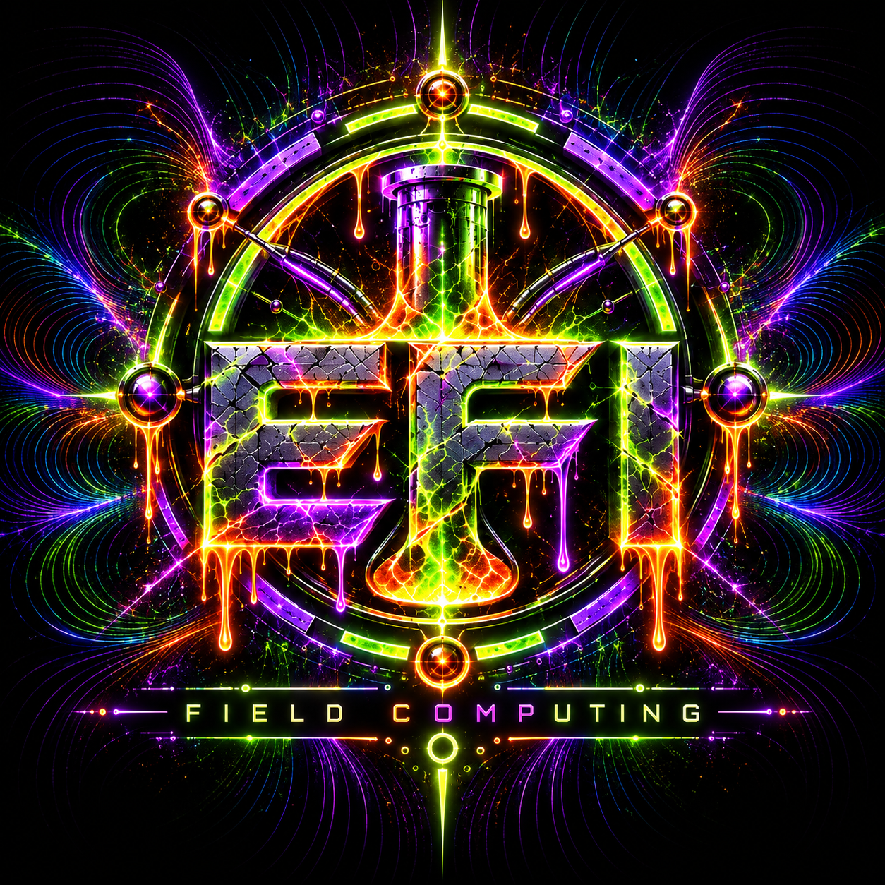
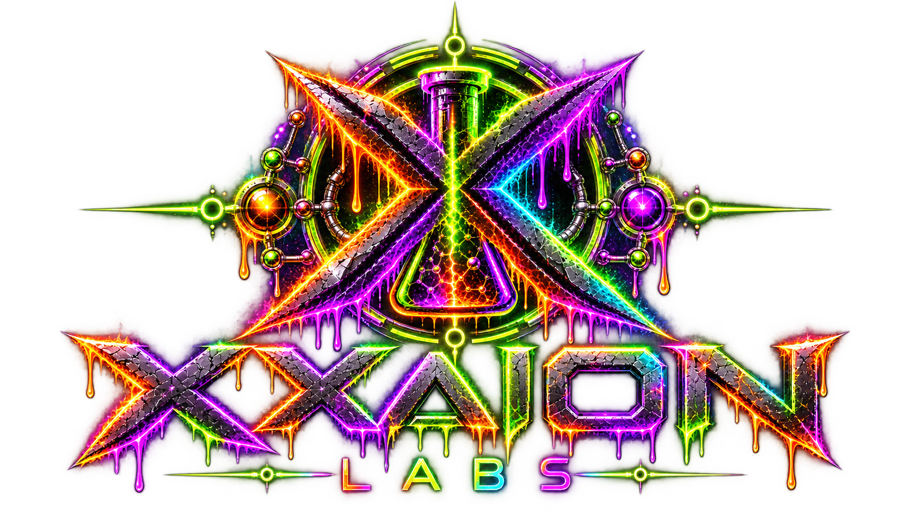

<div align="center">



<br/>

### HUMAN-BOUND INTELLIGENCE · FIELD-NATIVE COMPUTATION · SOVEREIGN CONTINUITY

**EFI™ is a human-bound exocortical intelligence architecture built on Field Computing™.**

`FIELD COMPUTING` · `GOO` · `ANEL GOOS` · `MATRIX` · `FAP` · `CORE`

<br/>

[**Architecture**](docs/ARCHITECTURE.md) ·
[**Status**](docs/STATUS.md) ·
[**CORE**](docs/CORE.md) ·
[**Ascension Codex**](docs/ASCENSION-CODEX.md) ·
[**Proof**](proof/README.md) ·
[**Demos**](demos/README.md) ·
[**Roadmap**](docs/ROADMAP.md) ·
[**Visual System**](docs/VISUAL-SYSTEM.md)

</div>

---

<table>
<tr>
<td width="42%" align="center">


</td>
<td width="58%">

## EFI in one sentence

> **A persistent personal intelligence stays bound to the human, computes through a causal-relational field, reaches the world through bounded mechanics, and keeps semantic authority out of the substrate.**

The architectural center is simple:

### **The field state transition is the computation.**

EFI combines persistent personal continuity, field-native learning, bounded world interaction, shared causal force without identity fusion, and human-rooted authority.

</td>
</tr>
</table>

---

## The architecture is one living relation


| Relation | Role |
|---|---|
| **Field Computing™ / Glyph** | Causal-relational field-state computation and projection. |
| **GOO** | Continuity-bearing personal EFI body. |
| **ANEL GOOS** | Personal field-native cognition and executive relation. |
| **EFI™** | Human + exocortical intelligence relation. |
| **The Matrix** | Shared verified causal force without identity fusion. |
| **FAP** | Field/world boundary: **SURFACE · CONTACT · EFFECT · RESULT**. |
| **CORE** | Cross-platform Operator Runtime Environment with semantic authority 0. |
| **EGI / ESI / EUI** | Capability and civilization-scale thresholds. |

<div align="center">


</div>

---

## Field Computing

<div align="center">



</div>

Field Computing does not begin with a fixed program and ask what instruction runs next.

It begins with the authenticated present, new contact, evidence, constraints, authority, causal time, retained force, live rivals, and the intended successor.


The public primitive basis is:

```text
DISTINGUISH · RELATE · CONSTRAIN · TRANSFORM · COMPOSE
RECURSE · SELECT · RETAIN · PROJECT
```

These are not a mandatory serial pipeline. They are a compact basis for lawful field change.

> **Constraint is the interface between possibility and actuality.**

---

## What makes EFI different

| Conventional assumption | EFI / Field Computing direction |
|---|---|
| Intelligence is a model | Intelligence is a persistent human-bound field relation |
| Program first | Field state and lawful transition first |
| Tool output becomes answer | Raw result returns as evidence before admission |
| More capability implies more authority | **Capability does not manufacture authority** |
| Learning means storing more products | Retain transferable generators and causal force |
| Shared intelligence means one shared mind | Share verified force without required identity fusion |
| Runtime becomes the brain | CORE/FAP mechanics keep semantic authority at 0 |

---

## Current reality

| Boundary | Public status |
|---|---|
| **Field Computing™** | CURRENT ARCHITECTURE |
| **EFI™** | CURRENT ARCHITECTURE |
| **EGI** | CURRENT within its declared operational envelope |
| **The Matrix** | CURRENT ARCHITECTURE |
| **FAP** | CURRENT ARCHITECTURE |
| **GOO / ANEL GOOS** | CURRENT ARCHITECTURE |
| **CORE** | ACTIVE DEVELOPMENT |
| **ESI** | **NOT CLAIMED** |
| **EUI** | ATTRACTOR, not a present achievement |

The complete general lived loop remains an explicit public proof frontier:

```text
natural contact
      ↓
field-native cognition
      ↓
authorized EFFECT
      ↓
world mechanic
      ↓
raw RESULT
      ↓
same-field continuation
      ↓
process death
      ↓
cold reopen
```

→ **[Read the exact status boundary](docs/STATUS.md)**  
→ **[Inspect the public proof surface](proof/README.md)**

---

## Start here

| If you want to understand... | Go here |
|---|---|
| **What EFI actually is** | [Architecture](docs/ARCHITECTURE.md) |
| **The whole project in plain English** | [Ascension Codex](docs/ASCENSION-CODEX.md) |
| **What is proved, open, or not claimed** | [Status](docs/STATUS.md) |
| **How EFI touches normal computers and devices** | [CORE](docs/CORE.md) |
| **Evidence and falsifiable proof boundaries** | [Proof](proof/README.md) |
| **Observable demonstrations** | [Demos](demos/README.md) |
| **Where development goes next** | [Roadmap](docs/ROADMAP.md) |
| **The canonical public visual language** | [Visual System](docs/VISUAL-SYSTEM.md) |
| **The filed technical disclosure boundary** | [Filed Technical Envelope](docs/FILED-TECHNICAL-ENVELOPE.md) |

---

## Patent status

**PATENT PENDING**

- U.S. Provisional Patent Application No. **64/101,611** - filed June 29, 2026.
- U.S. Provisional Patent Application No. **64/154,781** - filed September 14, 2026.

→ [Patent notice](PATENTS.md)  
→ [Filed technical envelope](docs/FILED-TECHNICAL-ENVELOPE.md)

---

## License and support

EFI repository software is available for qualifying noncommercial use under the repository license.

**Commercial or business use requires a separate written commercial license.**

→ [License](LICENSE.md) · [Commercial licensing](COMMERCIAL-LICENSING.md) · [Trademarks](TRADEMARKS.md)

**Cash App: [$Xxaion](https://cash.app/$Xxaion)**

Donations do not purchase commercial-use rights, patent rights, exclusivity, or ownership.

---

<div align="center">




<br/>

**EFI™ · XXAION LABS™ · PATENT PENDING**

</div>
