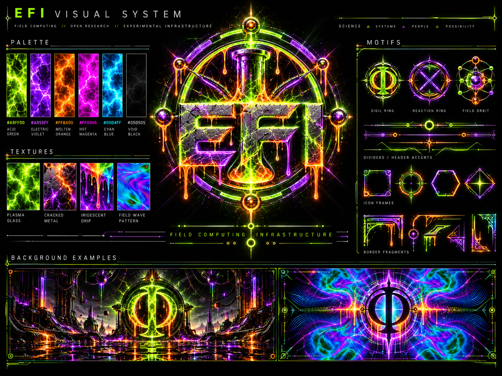

# EFI™ Public Assets

**CANONICAL PUBLIC VISUAL LANGUAGE**

[Visual System Guide](../docs/VISUAL-SYSTEM.md) · [Repository Home](../README.md)

---

This directory contains the canonical public visual system for EFI and Field Computing.

## Visual language

- **Void black:** `#050505`
- **Acid green:** `#A8FF00`
- **Electric violet:** `#A855FF`
- **Molten orange:** `#FF8A00`
- **Hot magenta:** `#FF00E6`
- **Cyan blue:** `#00D4FF`

Primary motifs: luminous field rings, sigils, orbital nodes, cracked metal, plasma glass, iridescent drip, field-wave interference, instrument-line dividers, and high-contrast negative space.

## Brand

- [EFI hero](brand/efi-hero.png)
- [EFI field sigil](brand/efi-sigil.png)
- [EFI lockup](brand/efi-lockup.png)
- [Visual system](brand/efi-visual-system.png)
- [UI / motif kit](brand/efi-ui-kit.png)
- [Field Computing emblem](brand/efi-field-computing.png)
- [Xxaion Labs lockup](brand/xxaion-labs.png)

## Diagrams

- [EFI architecture](diagrams/efi-architecture.svg)
- [Field transition](diagrams/field-transition.svg)
- [CORE boundary](diagrams/core-boundary.svg)

The supplied PNG masters are the canonical public brand artwork. SVG is reserved for technical diagrams and geometry that benefits from a diffable vector source.

---

**EFI™ · Xxaion Labs™ · PATENT PENDING**
