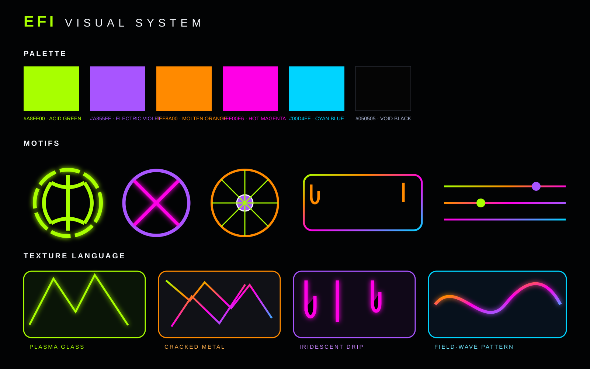

# EFI™ Public Assets

**CANONICAL PUBLIC VISUAL LANGUAGE**

[Visual System Guide](../docs/VISUAL-SYSTEM.md) · [Repository Home](../README.md)

---

This directory contains the canonical public visual system for EFI and Field Computing.

## Visual language

- **Void black:** `#050505`
- **Acid green:** `#A8FF00`
- **Electric violet:** `#A855FF`
- **Molten orange:** `#FF8A00`
- **Hot magenta:** `#FF00E6`
- **Cyan blue:** `#00D4FF`

Primary motifs: luminous field rings, sigils, orbital nodes, cracked metal, plasma glass, iridescent drip, field-wave interference, instrument-line dividers, and high-contrast negative space.

## Brand

- [EFI hero](brand/efi-hero.svg)
- [EFI mark](brand/efi-mark.svg)
- [EFI lockup](brand/efi-lockup.svg)
- [Visual system](brand/visual-system.svg)
- [UI / motif kit](brand/ui-kit.svg)

## Diagrams

- [EFI architecture](diagrams/efi-architecture.svg)
- [Field transition](diagrams/field-transition.svg)
- [CORE boundary](diagrams/core-boundary.svg)
- [Component cards](diagrams/component-cards.svg)

SVG remains the canonical repository-native format so the public identity stays crisp, editable, diffable, and reusable.

---

**EFI™ · Xxaion Labs™ · PATENT PENDING**
