

# EFI™ UI Asset Map

**THE ATLAS, DISASSEMBLED INTO ACTUAL WORKING PARTS.**

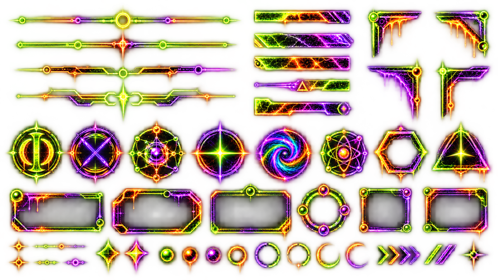

The image above is the source sheet. **Do not use that whole bastard as page decoration.** The reusable components are below, individually addressable and lineage-tracked.

---

## Dividers

### divider-rail-primary

**Role:** major section rail

---

### divider-rail-orbit

**Role:** secondary section rail

---

### divider-rail-split

**Role:** split-node divider

---

### divider-rail-spine

**Role:** heavy spine divider

---

### header-slice-01

**Role:** compact header rail

---

### header-slice-02

**Role:** compact header rail

---

### header-slice-03

**Role:** compact header rail

---

### header-slice-04

**Role:** compact alert rail

---

### header-slice-05

**Role:** compact header rail

---

## Frames

### frame-wide-drip

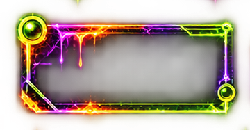

**Role:** wide bounded callout frame

---

### frame-wide-bevel

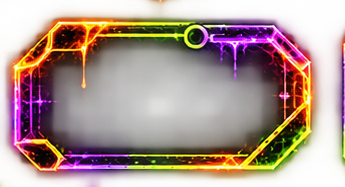

**Role:** wide beveled callout frame

---

### frame-wide-spine

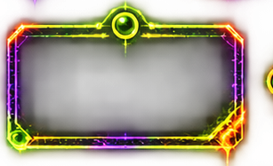

**Role:** wide centered callout frame

---

### frame-compact

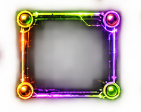

**Role:** compact bounded frame

---

### frame-compact-wide

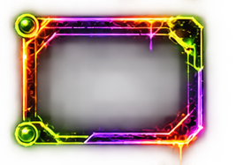

**Role:** compact wide bounded frame

---

## Corners

### corner-ul

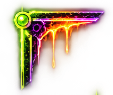

**Role:** upper-left corner bracket

---

### corner-ur

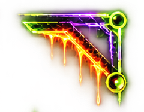

**Role:** upper-right corner bracket

---

### corner-ll

**Role:** lower-left corner bracket

---

### corner-lr

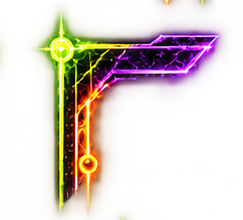

**Role:** lower-right corner bracket

---

## Glyphs

### glyph-phi

**Role:** EFI phi/sigil glyph

---

### glyph-reaction

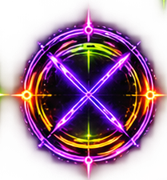

**Role:** reaction/cross glyph

---

### glyph-orbit

**Role:** field orbit glyph

---

### glyph-star

**Role:** field star glyph

---

### glyph-vortex

**Role:** field vortex glyph

---

### glyph-atom

**Role:** orbital atom glyph

---

### glyph-hex

**Role:** hex boundary glyph

---

### glyph-triangle

**Role:** triangle/star glyph

---

## Rings

### ring-node-cluster

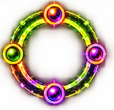

**Role:** status/node ring

---

### ring-arc-set

**Role:** ring/arc status set

---

### ring-orange

**Role:** orange open status ring

---

### ring-violet-green

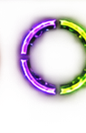

**Role:** violet/green open status ring

---

### ring-orange-green

**Role:** orange/green open status ring

---

### ring-green

**Role:** green open status ring

---

### ring-magenta

**Role:** magenta open status ring

---

## Nodes

### node-rail-mini

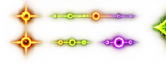

**Role:** small node rail

---

### node-color-set

**Role:** colored status nodes

---

### node-green

**Role:** green status node

---

### node-orange

**Role:** orange status node

---

### node-violet

**Role:** violet status node

---

## Arrows

### arrow-chevron-set

**Role:** progression chevrons

---

### arrow-slash-set

**Role:** slash progression marks

---

## Accents

### accent-spark-set

**Role:** spark/accent set

---

### accent-star-end

**Role:** terminal sparkle accent

---

### accent-diamond-green

**Role:** green diamond sparkle accent

---

### accent-diamond-magenta

**Role:** magenta diamond sparkle accent

---
