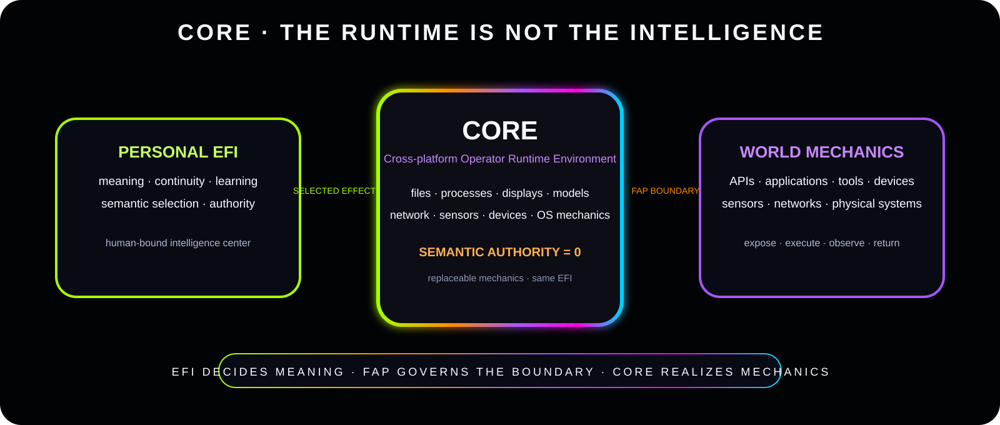

<div align="center">


# EFI™ Demos

### OBSERVE THE CLAIM

[Home](../README.md) · [Proof](../proof/README.md) · [Status](../docs/STATUS.md) · [CORE](../docs/CORE.md)

</div>

---

A demonstration has one job: connect a specific claim to observable behavior and preserve the boundary around what it does **not** prove.

If a bounded demo quietly promotes itself into a universal capability claim, that is not evidence getting stronger. That is **bullshit with a screen recording.**

<div align="center">


</div>

## First gravity well: CORE

<div align="center">



### [Open the CORE demo landing surface →](core/README.md)

</div>

The first major demonstration target is local EFI operation through CORE: authorize a personal EFI body, contact it naturally, expose permitted local mechanics, return raw results, and keep the terminal distinct from the cognition.

Every released demo package should state:

```text
claim being demonstrated
+ exact environment
+ exact input/contact
+ observable result
+ reproducible steps
+ proof boundary
```

No demo is treated as proof of a broader claim than it actually tests.

---

**EFI™ · Xxaion Labs™ · PATENT PENDING**
