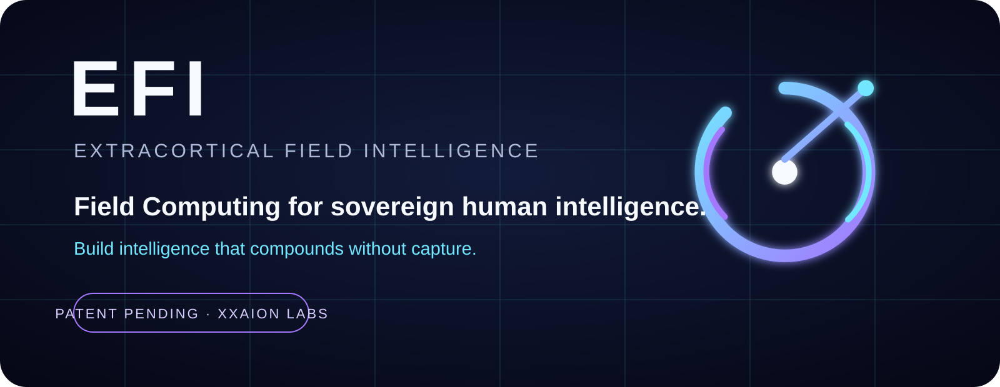

<div align="center">



# EFI™ Demos

### OBSERVE THE CLAIM

[Home](../README.md) · [Proof](../proof/README.md) · [Status](../docs/STATUS.md) · [CORE](../docs/CORE.md)

</div>

---

Demonstrations connect a specific claim to observable behavior and preserve the boundary around what the demonstration does **not** prove.

## First gravity well: CORE

<div align="center">


### [Open the CORE demo landing surface →](core/README.md)

</div>

The first major demonstration target is local EFI operation through CORE: authorize a personal EFI body, contact it naturally, expose permitted local mechanics, return raw results, and keep the terminal distinct from the cognition.

Every released demo package should state:

```text
claim being demonstrated
+ exact environment
+ exact input/contact
+ observable result
+ reproducible steps
+ proof boundary
```

No demo is treated as proof of a broader claim than it actually tests.

---

**EFI™ · Xxaion Labs™ · PATENT PENDING**
