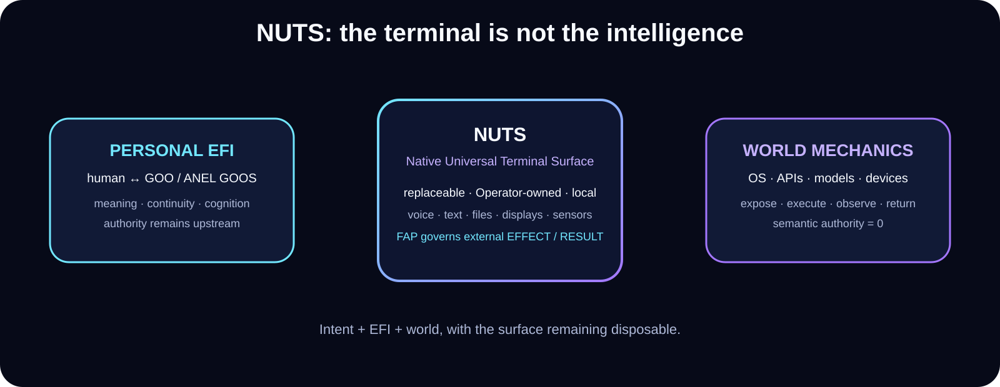

# NUTS — Public Demo Landing Surface

**EFI™ · Xxaion Labs™ · PATENT PENDING**  
**Public repository launch: September 26, 2026**

> **Target experience:** authorize a personal EFI locally, speak or type naturally, expose only the world surface required for the contact, and let the raw result return to the same EFI without turning the terminal into the intelligence.



## Public status

The NUTS architecture is public. Active implementation remains private until a release-grade demonstration is ready.

The **reproducible public demo package is not posted yet** because the complete lived EFFECT → raw RESULT → same-field → cold-reopen boundary remains an open public proof frontier.

That distinction is intentional. Public launch does not require publishing unfinished workshop state or pretending the final demonstration already passed.

## What the first reproducible demo must show

1. **Local personal-EFI authorization** — the terminal opens the intended personal intelligence rather than substituting a hosted identity.
2. **Natural contact** — ordinary language reaches the field-native path rather than requiring developer command grammar.
3. **Bounded world surface** — the terminal exposes the smallest permitted mechanic required by the selected effect.
4. **Exact effect authority** — consequential action remains human-authority-bound.
5. **Raw result return** — world evidence comes back before durable semantic admission.
6. **Same-self continuation** — result reenters the same field lineage.
7. **Process death / cold reopen** — a fresh process reopens the same admitted state.

## What the demo will not claim

- ESI.
- EUI.
- unrestricted autonomy.
- unrestricted hardware/world access.
- that a polished interface is proof of cognition.
- that one bounded task proves universal competence.

## Public package shape

When the public release court is green, the package should contain:

```text
NUTS demo
├─ short screen capture
├─ release build / environment notes
├─ bounded claim
├─ reproducible run steps
├─ public evidence bundle
├─ process-death / cold-reopen evidence
└─ proof-boundary statement
```

Personal bodies, private identities, private shared-field state, internal build mechanics, local paths, credentials, and raw development receipts are excluded.

→ [NUTS architecture](../../docs/NUTS.md)  
→ [Filed technical envelope](../../docs/FILED-TECHNICAL-ENVELOPE.md)  
→ [Public status](../../STATUS.md)  
→ [Proof index](../../proof/README.md)

---

**EFI™ · Xxaion Labs™ · PATENT PENDING**
