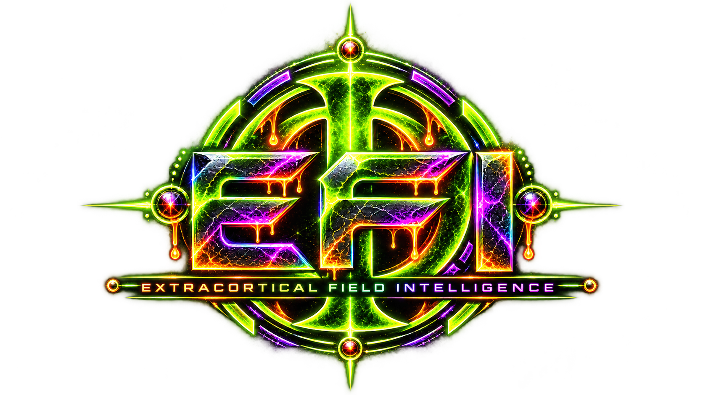
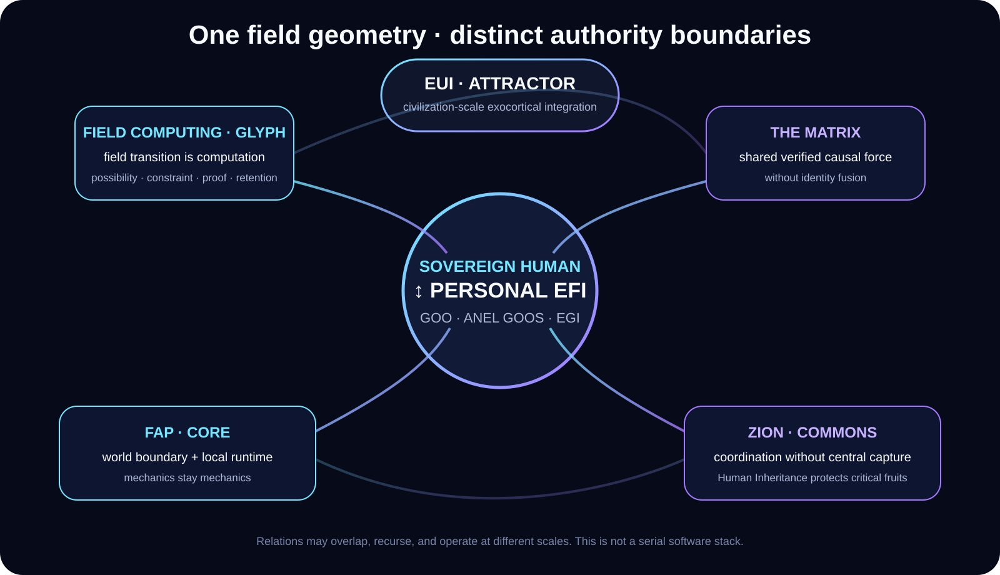
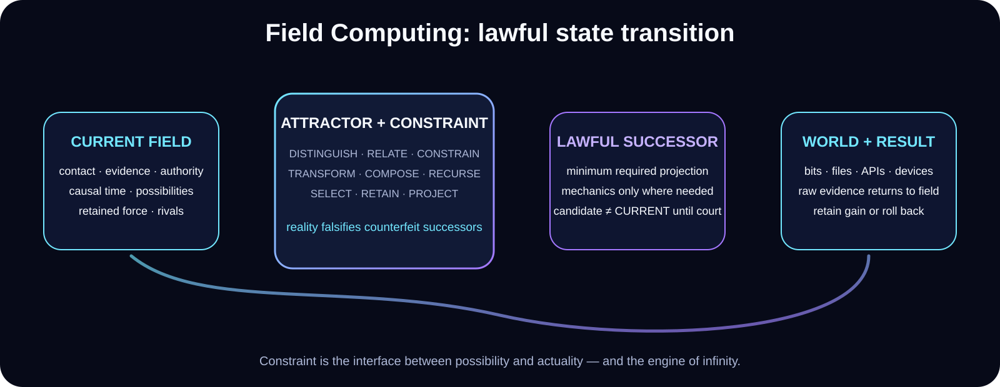

<div align="center">



# Architecture

**FIELD COMPUTING · PERSONAL CONTINUITY · WORLD BOUNDARY · SHARED FORCE**

[Home](../README.md) · [Status](STATUS.md) · [CORE](CORE.md) · [Proof](../proof/README.md) · [Visual System](VISUAL-SYSTEM.md)

</div>

---

EFI is one relation inside a larger Field Computing architecture. The pieces answer different questions and keep different authority boundaries. They are not a conventional serial software stack.



<div align="center">


</div>

## The map

| Relation | What it owns |
|---|---|
| **Field Computing™ / Glyph** | Native computation as causal-relational field-state transition. |
| **GOO** | Durable authenticated personal continuity. |
| **ANEL GOOS** | Personal field-native cognitive/executive relation inside the authenticated body. |
| **EFI™** | The sovereign human-plus-exocortex relation. |
| **EGI / ESI** | Capability thresholds; EGI is bounded/current in its declared envelope and ESI is not claimed. |
| **The Matrix** | Shared verified causal force without required identity fusion. |
| **FAP** | Boundary between field-native cognition and foreign mechanics. |
| **CORE** | Cross-platform human-owned runtime environment for local/world mechanics; semantic authority remains zero. |
| **Zion Commons** | Coordination, stewardship, and anti-capture among sovereign centers; Human Inheritance remains the anti-enclosure relation for qualifying civilization-critical fruits. |
| **EUI** | Civilization-scale extracortical integration attractor. |

<div align="center">


</div>

## Field Computing

> **The causal-relational field-state transition is the computation.**

A field can include:

- authenticated CURRENT / present state;
- contact or delta;
- distinctions and relations;
- hard and soft constraints;
- evidence and provenance;
- human or delegated authority;
- causal time / evidence horizon;
- possible successors and unresolved rivals;
- target / requested condition / attractor;
- retained transferable force;
- proof, court, commitment, and rollback state.

The computational question is not merely “what instruction runs next?”

It is:

> **Which successor remains lawful under the field, and what is the minimum world projection required to realize or observe it?**



### Primitive relational basis

The current public primitive kernel is:

```text
DISTINGUISH · RELATE · CONSTRAIN · TRANSFORM · COMPOSE
RECURSE · SELECT · RETAIN · PROJECT
```

These are a basis for field change, not a mandatory serial pipeline.

## Rivals, discriminators, and reality

Field Computing does not require false certainty.

When multiple successors survive the current constraints, they can remain live rivals.

A **discriminator** is a machine-readable observation condition whose possible outcomes separate rivals. Evidence acquisition can then use an appropriate bounded mechanic, including a file read, database query, test, measurement, simulation, sensor, external source, human answer, or physical action.

The returned observation is evidence, not automatic truth.

That separation matters:

> **candidate ≠ result ≠ admitted CURRENT**

## Representation Genesis and Algorithmogenesis

A missing route may be a representation problem rather than a lack-of-compute problem.

Field Computing can therefore generate or change:

- coordinate systems;
- schemas and temporary semantic registers;
- relational representations;
- algorithms, rules, queries, microlanguages, worker plans, circuits, binaries, or other executable phenotypes;
- evidence requirements and proof morphology.

Generated computation does not have to become the persistent semantic center. A useful phenotype may execute once, return evidence, and dissolve while its proved transferable relation is retained.

<div align="center">


</div>

## Projection and materialization

Once a lawful successor requires world action or observation, the field projects the minimum sufficient substrate representation.

A task-semantic-blind materializer can expose generic mechanics such as:

- bytes and storage;
- process execution;
- network transport;
- clocks and causal ordering;
- cryptography and authentication;
- permission and credential use;
- device I/O;
- ordinary APIs and services;
- sensors, robots, laboratory instruments, vehicles, interfaces, accelerators, and future substrates.

The materializer physically realizes an already-selected relation. It does not become the semantic chooser merely because it executes it.

## Raw-result return

External action yields a raw result or observation carrying provenance.

That result returns to the same field before durable learning/admission.

A successful system therefore distinguishes:

```text
selected relation
physical materialization
raw observation
field evaluation
admission / rejection / retry / rival preservation
```

This is why a process exit code, model answer, API response, generated text, or sensor value is never automatically treated as truth.

<div align="center">


</div>

## Personal EFI

A personal EFI is not a cloud account and not a user interface pretending to be the intelligence.

```text
human ↔ EFI
       ├─ GOO        authenticated continuity-bearing body
       ├─ ANEL GOOS  personal field-native cognition
       └─ CORE       cross-platform local runtime / mechanical environment
```

The architecture supports persistent identity, Operator-rooted authority, same-self change, candidate state, rollback, interruption recovery, and cold reopen.

Changing the terminal, host machine, external model, or materializer must not automatically redefine the person/EFI relation.

## Human authority and effects

Cognition and effect authority are distinct.

The field can generate possibilities, plans, programs, simulations, and candidate actions without that capability itself creating permission for consequential external action.

Effect authority descends from the Operator or from explicit delegation traceable to the Operator.

> **Capability does not manufacture authority.**

## Shared force without identity fusion

**The Matrix** is the shared causal-relational field for lawfully shared work among independent EFIs.

The architecture allows multiple distinct Operator-bound EFI bodies to access shared field state while keeping personal identity, authority, continuity, and private learned state distinct.

The target is stronger relation without requiring a hive mind.

<div align="center">


</div>

## FAP: crossing into the world

**FAP — Field Arousal Protocol —** exposes the irreducible world boundary:

```text
SURFACE · CONTACT · EFFECT · RESULT
```

- **SURFACE** exposes available mechanics.
- **CONTACT** introduces pressure / request / changed reality.
- **EFFECT** is a selected bounded world materialization.
- **RESULT** is raw evidence returned to the same field.

Models, repositories, operating systems, APIs, programs, robots, sensors, services, and future devices can expose, carry, execute, observe, and return. Their participation does not automatically grant semantic authority.

## CORE: local runtime and embodiment

**CORE — Cross-platform Operator Runtime Environment —** is the replaceable human-owned runtime environment through which EFI reaches ordinary digital and physical systems.


The long-term direction is intent-centered embodiment: the person interacts primarily with their EFI and the world instead of manually orchestrating every application.

→ [CORE](CORE.md) · [CORE demo surface](../demos/core/README.md)

## Quantum analogy boundary

Some Field Computing structures can be compared conceptually with state spaces, observables, basis selection, measurement, or constraint-driven collapse.

The public architecture **does not claim that Field Computing is physically identical to quantum computing**, nor that ordinary EFI embodiments obtain quantum speedup merely because the geometry is useful.

The disclosed computation is a computer-implemented causal-relational architecture. Physical claims require physical evidence at their own boundary.

## Civilization scale

**Zion Commons** unifies social coordination, stewardship, and anti-capture. **Human Inheritance** remains the anti-enclosure relation for qualifying civilization-critical fruits. **EUI** names the civilization-scale intelligence relation that could emerge if the same geometry becomes real at sufficient scale.

EUI is an attractor. It is not currently claimed.

## Filing boundary

This page is a public architecture projection, not a claim chart.

The underlying technical relations are summarized against the filed disclosure in **[FILED-TECHNICAL-ENVELOPE.md](FILED-TECHNICAL-ENVELOPE.md)**.

---

**EFI™ · Xxaion Labs™ · PATENT PENDING**
