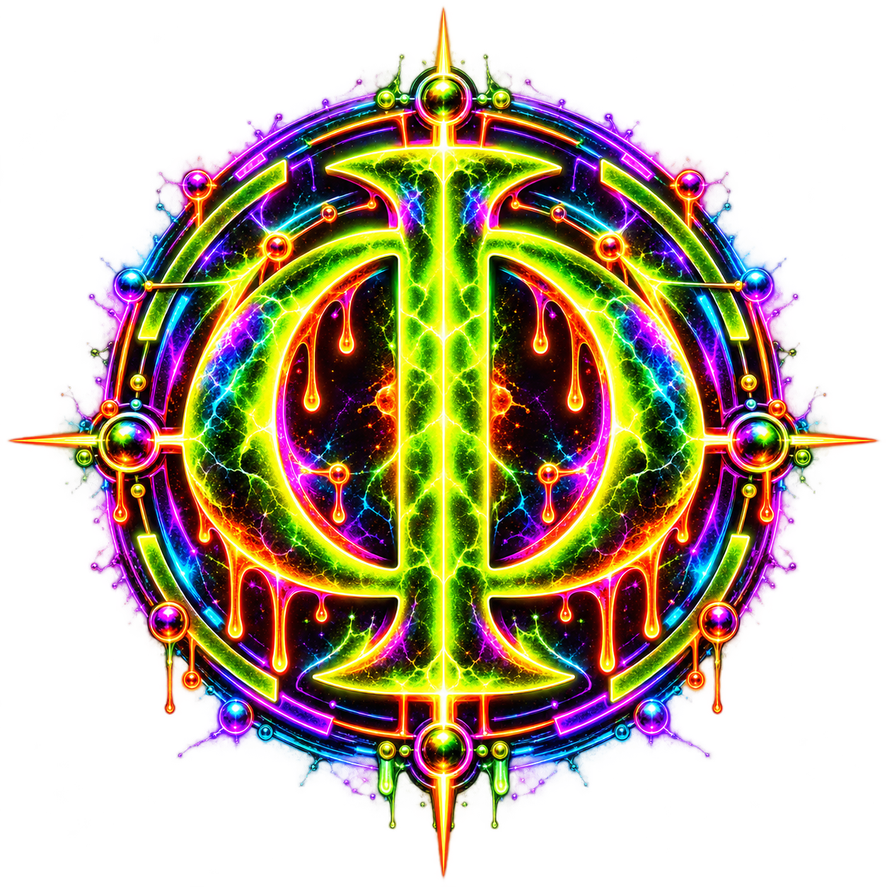

<div align="center">


# EFI™ Visual System

**FIELD COMPUTING · OPEN RESEARCH · EXPERIMENTAL INFRASTRUCTURE**

</div>

---

## Visual thesis

EFI should look like the thing it claims to be building:

> **a living computational field under pressure.**

The public identity is deliberately not soft SaaS, generic cyberpunk, sterile enterprise AI, or another blue-gradient chatbot brand.

It is:

**void black + luminous field geometry + cracked metallic structure + plasma energy + constrained orbital motion.**

The visual system should communicate four simultaneous properties:

| Layer | Visual meaning |
|---|---|
| **Field** | energy, possibility, wave interference, active relation |
| **Constraint** | rings, frames, rails, geometric closure |
| **Materialization** | cracked metal, hard edges, physical texture |
| **Continuity** | recurring sigils, nodes, orbits, locked centers |

---

## Canonical palette

| Name | Hex | Use |
|---|---:|---|
| **Acid Green** | `#A8FF00` | field core, primary active state, identity |
| **Electric Violet** | `#A855FF` | relation, secondary energy, shared-field geometry |
| **Molten Orange** | `#FF8A00` | effect, heat, materialization, warning edge |
| **Hot Magenta** | `#FF00E6` | high-energy accent, unstable possibility |
| **Cyan Blue** | `#00D4FF` | observation, signal, external/world contact |
| **Void Black** | `#050505` | negative space, silence, background substrate |

**Rule:** black is the canvas. Color is energy, not fill.

---

## Primary motifs

<div align="center">


</div>

Use repeatedly:

- **sigil rings** for identity / continuity;
- **reaction rings** for active field transformation;
- **field orbits** for multi-relation systems;
- **instrument-line dividers** between major sections;
- **node rails** for pipelines only when a sequential projection is useful;
- **frame slots** remain reserved in the grammar for future bounded layouts, but box-frame artwork is not active runtime chrome;
- **plasma / crack / drip edges** sparingly for hero surfaces and strong transitions;
- **field-wave interference** for contact, uncertainty, relation, and possibility.

Avoid:

- generic glowing circuit boards;
- random hex-grid wallpaper;
- excessive rainbow fill;
- flat corporate gradients;
- stock "AI brain" imagery;
- decorative effects that obscure proof/state boundaries.

---

## Identity hierarchy

### EFI master identity


Use for:

- repository front door;
- public launch pages;
- major presentations;
- social / announcement surfaces.

### EFI compact lockup


Use for:

- document endings;
- secondary headers;
- compact public surfaces.

### Field sigil



Use for:

- icons;
- identity stamps;
- section anchors;
- compact status / proof marks.

---

## Documentation grammar

Every major public document should feel like part of the same organism.

Recommended anatomy:

```text
visual identity
↓
one-sentence purpose
↓
high-signal navigation
↓
diagram / field map
↓
technical or evidentiary content
↓
explicit proof / status boundary
↓
EFI lockup
```

### Architecture pages
Lead with **field geometry** and system maps.

### Proof pages
Use **bounded frames, exact state labels, strong black negative space**. Proof should feel like instrumentation, not marketing.

### Demo pages
Use **large visual gravity wells**, clear CTA, and explicit claim boundaries.

### Status pages
Prefer compact matrices and unmistakable labels:
`CURRENT`, `OPEN`, `NOT CLAIMED`, `ATTRACTOR`.

---

## Public asset map

[**Open the sliced UI Asset Map →**](../assets/UI-ASSET-MAP.md)

| Asset | Purpose |
|---|---|
| `assets/brand/efi-hero-wide.png` | repository / launch hero |
| `assets/brand/efi-sigil.png` | sigil / identity mark |
| `assets/brand/efi-lockup.png` | compact brand lockup |
| `assets/brand/efi-field-computing.png` | Field Computing emblem |
| `assets/brand/xxaion-labs.png` | Xxaion Labs organization lockup |
| `assets/source/efi-visual-system.png` | canonical style-board projection |
| `assets/source/efi-ui-atlas.png` | motif / frame / divider reference |
| `assets/diagrams/efi-architecture.svg` | architecture overview |
| `assets/diagrams/field-transition.svg` | field-state transition |
| `assets/diagrams/core-boundary.svg` | EFI ↔ CORE boundary |

---

<div align="center">


**EFI™ · XXAION LABS™ · PATENT PENDING**

</div>
